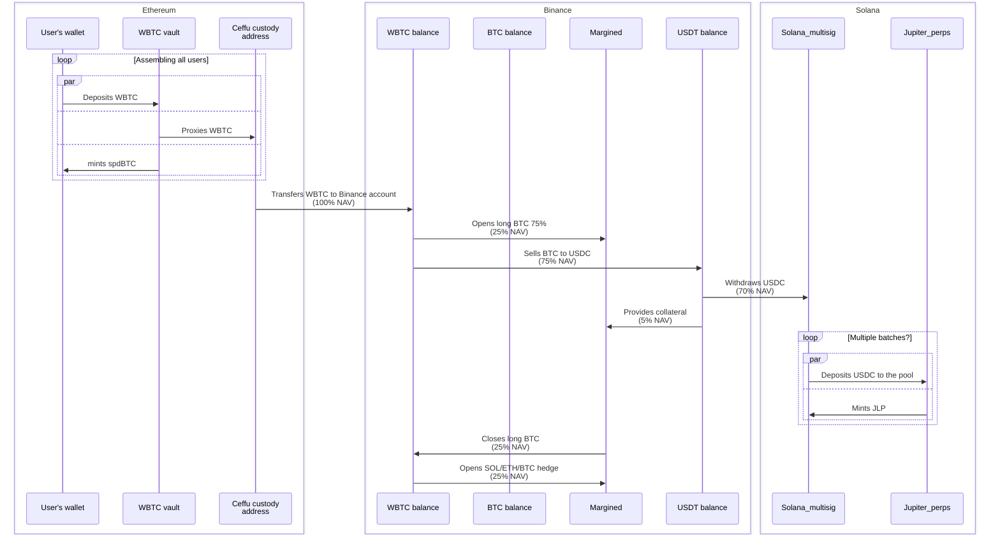

# Solana Integration

maxBTC does two main things to generate its BTC-denominated yield:

1. Extracts yield from Jupiter Liquidity Provider (JLP) tokens
2. Hedges the SOL and ETH exposure (as well as traders' PnL) on Binance

This document explains how the Solana blockchain integration works for the first part.

## Jupiter Perpetuals Overview

<Note>
JLP is an LP token of the Jupiter Perpetuals pool. Essentially, it's an index token of 5 assets (SOL, ETH, BTC, USDC, USDT). Besides that, it also compounds Jupiter trading fees and traders' PnL.
</Note>

High-level operations of the "JLP" part are:

1. Getting deposits from Ethereum/Binance to Solana
2. Processing withdrawals back to Ethereum
3. Rebalancing positions when needed:
   - Based on the allocations of the assets in the JLP pool (to hedge the SOL/ETH exposure)
   - Based on the current positions in Jupiter Perpetuals (to hedge potential traders' profits)

## Asset Flow Diagram

The following diagram shows how assets flow through the system during the private deposit phase:



## Jupiter Integration Challenges

### Direct Mint/Burn Limitations

When interacting with Jupiter's JLP, there are several limitations to consider:

1. **Total TVL Cap**: We cannot provide more assets than the platform limit (current remaining quota is approximately 320M)
2. **Per-asset Limit**: We cannot provide more than the target weightage +20% for each asset (and same for withdrawals)
3. **UI Inconsistencies**: The Jupiter UI may show that deposits are possible even when they would exceed the asset limit

<Warning>
The current target weightage for BTC is 11%, thus it can fluctuate only between 8.8% and 13.2%. However, if the current weight exceeds this range (e.g., 14.63%), no BTC can be provided despite what the UI might show. Always verify transaction feasibility before proceeding.
</Warning>

### Asset Restrictions

There are limitations on which assets can be used:

1. From Binance on Solana, we can only withdraw SOL, USDC, and USDT
2. We cannot directly withdraw ETH and WBTC to Solana because they exist only as Wormhole-bridged assets (Portal bridge)

For large amounts that significantly change asset distribution, specialized handling is required. For the MVP, we primarily use the BTC → USDC → USDC on Solana → JLP route (and the reverse for withdrawals).

## Technical Implementation

For the private deposit phase, we've implemented a simplified solution using a multisig with specialized permissions:

<CardGroup cols={2}>
  <Card title="Multisig Setup" icon="shield-halved">
    The multisig provides security while allowing controlled automated operations. It has a 4/7 threshold with keys distributed among team members and partners.
  </Card>
  <Card title="Bot Integration" icon="robot">
    A bot account has restricted permissions to perform only allowed actions for maintaining positions and handling rebalancing when needed.
  </Card>
</CardGroup>

## Security Considerations

<AccordionGroup>
  <Accordion title="Revocability">
    Unlike CEX API keys, Solana private keys cannot be revoked if compromised, requiring a stronger security model.
  </Accordion>
  <Accordion title="Multisig Architecture">
    The multisig has ultimate power over the funds, while the bot has limited power to move tokens and swap within given limits.
  </Accordion>
  <Accordion title="Smart Contract Security">
    For the MVP implementation, the smart contract only temporarily holds assets that need to be swapped, reducing security risks.
  </Accordion>
</AccordionGroup>

## Monitoring and Safety

To prevent liquidation risk due to significant price movements:

1. A "safety" metric is calculated and monitored based on our LTV from Binance
2. Conservative thresholds are implemented to trigger rebalancing
3. Automated rebalancing logic adjusts positions when needed

The thresholds are deliberately conservative to account for:
- Time delays between trigger events and collateral adjustments
- Costs of rebalancing (perpetuals liquidity withdrawal fees, trading fees)

```

</rewritten_file>