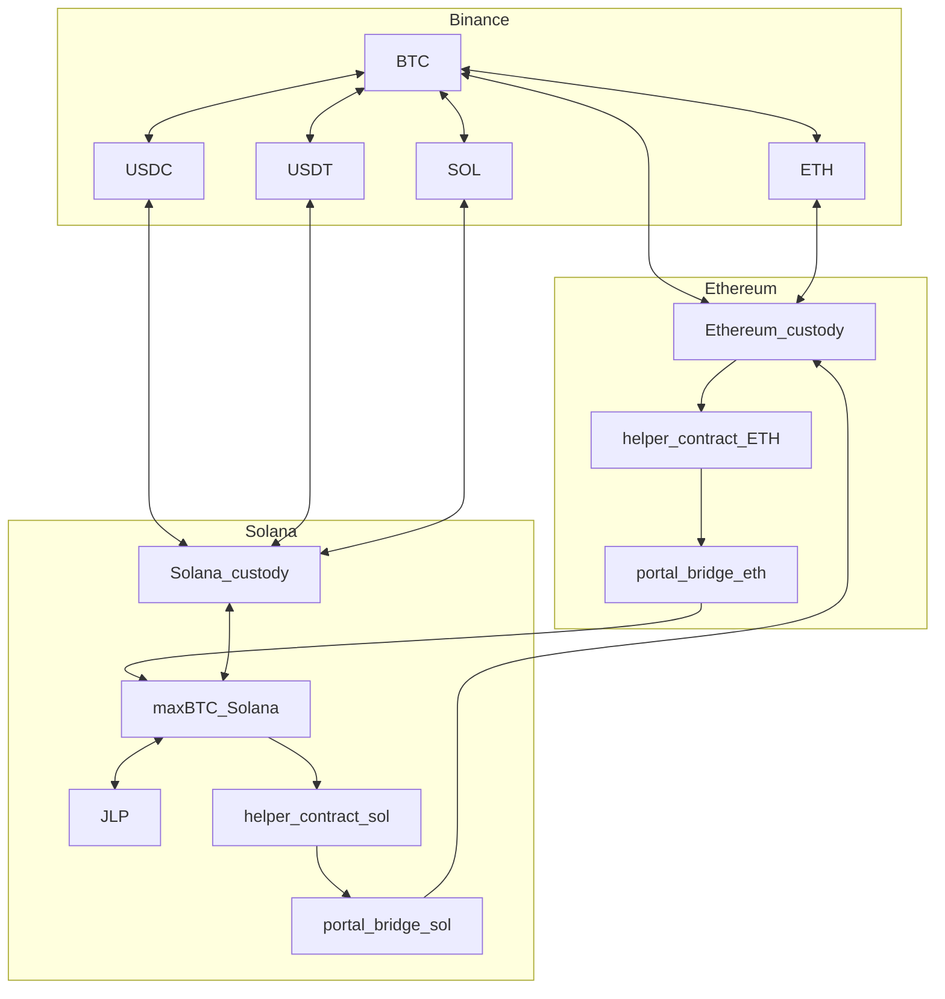
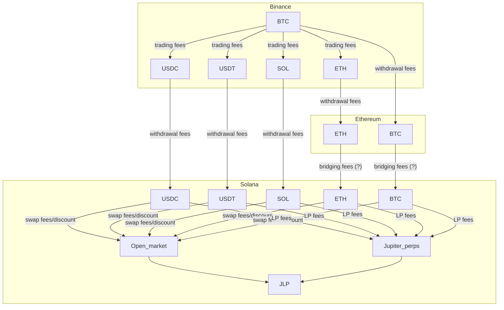
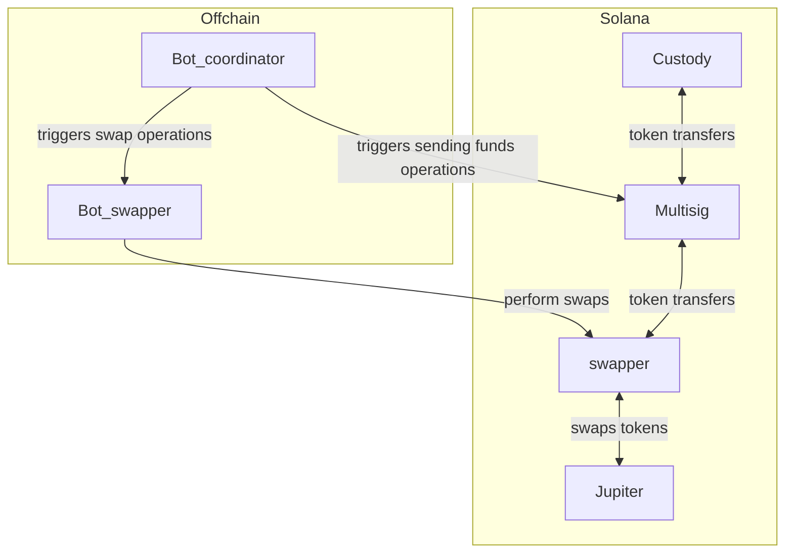
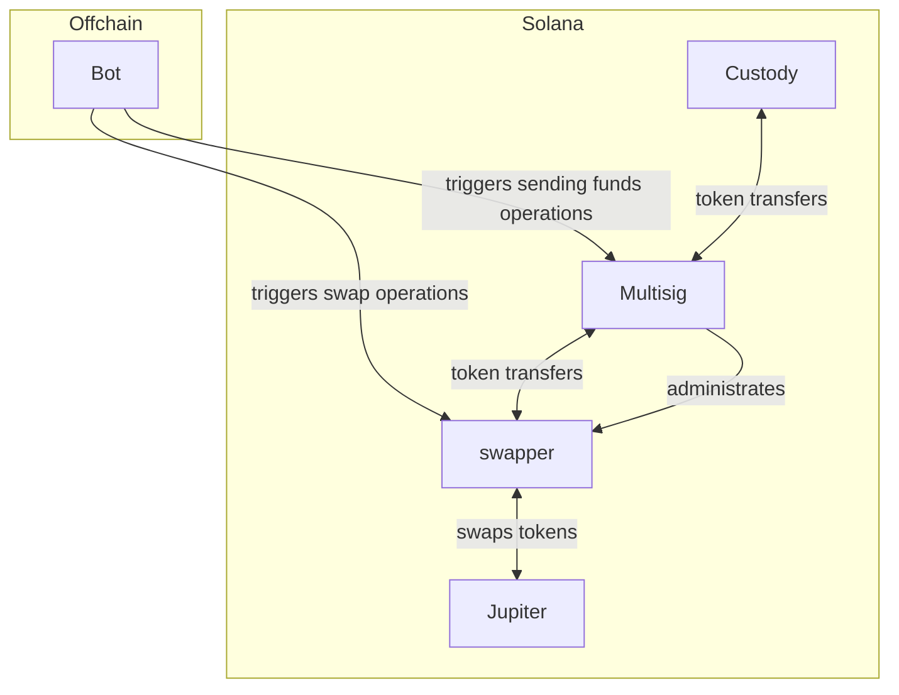
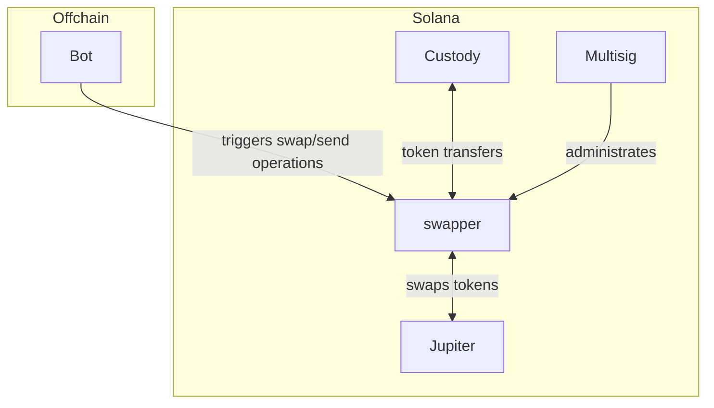

maxBTC does two things ([Private Deposit Documentation Information](https://www.notion.so/Private-Deposit-Documentation-Information-1b285d6b9b10808faa01e2f3da2645e1?pvs=21) ):

- extracts yield from JLP
- hedges the SOL and ETH exposure (as well as traders’ PnL) on Binance

To do the first part, it needs to operate on Solana.

The second part is described here: [maxBTC Server](https://www.notion.so/maxBTC-Server-1b385d6b9b10801ba935e8e6916f6187?pvs=21) 

High-level operations of the “JLP” part are:

1. Getting deposits
2. Processing withdrawals
3. Rebalancing the positions when needed
    1. based on the allocations of the assets in the JLP pool (to hedge the SOL/ETH exposure)
    2. based on the current positions in Jupiter Perpetuals (to hedge the potential traders’ profits)

Thus, we need a module that does all of that on the Solana blockchain.

The document below contains the research made on:

1. Jupiter products in general
2. Potential way to implement the module needed

# Table of contents

# Dictionary

| Name | Description |
| --- | --- |
| JLP | LP token of the Jupiter Perpetuals pool. Essentially, it’s an index token of 5 assets (SOL, ETH, BTC, USDC, USDT). Besides that, it also compounds Jupiter trading fees and traders’ PnL |
|  |  |

## How to buy/sell JLP?

There are two options:

1. Open market (Jupiter swap)
2. Direct JLP mint/burn with Jupiter Perpetuals

### Open market

Buying in the open market for the user looks as simple as going to the Jupiter Swap UI and doing a swap. Jupiter router does the best it can to find the best price. An important note is that the router routes through the Perps pool as well.

To see the route, see the following button:


Let’s check several examples:

1. A small amount is usually routed through some liquidity pools 
    
    
    
2. A big amount goes directly to the Perps pool
    
    
    
3. With HUGE amounts, the router is confused and tries to do the best out of the worst, facing the limitations of the perps pool (see [The per-asset limit. As it’s mentioned in the docs here http://station.jup.ag/guides/jlp/How-JLP-Works#failsafe-mechanism, you cannot provide more than the target weightage +20% for each asset (same for withdraw).](https://www.notion.so/The-per-asset-limit-As-it-s-mentioned-in-the-docs-here-http-station-jup-ag-guides-jlp-How-JLP-Wor-1b985d6b9b108039a6c1e47de78f739b?pvs=21) ) and limited liquidity (notice that in this example, we get fewer JLP tokens than in the previous one)
    
    
    
    
    

### Direct mint/burn

Basically, this is the ultimate way of getting JLP, and it brings the ultimate limitations.

These limitations are:

1. The total cap of TVL. We just cannot provide more assets than this limit. You can see the limit here: https://jup.ag/perps-earn (AUM — assets under management — limit). The current remaining quota is 320M
2. The per-asset limit. As it’s mentioned in the docs here http://station.jup.ag/guides/jlp/How-JLP-Works#failsafe-mechanism, you cannot provide more than the target weightage +20% for each asset (same for withdraw).
3. The fees

The UI for direct mint/burn (https://jup.ag/perps-earn) is incorrect in its assumptions, though, for some reasons.

Let’s see an example:

The current target weightage for BTC is 11%. Thus, it can fluctuate only between 8.8% and 13.2%. However, the current weight (at the moment of writing that) is 14.63%, which is way above the limit. It means that **no BTC can be provided**.

The UI sees no issues about it, though:


While a transaction to provide a single dollar of BTC [fails](https://solscan.io/tx/4S3WLDxYxJt3QmZNb9CfB1k1Ki6kx2SEFbqhkoo4KBjnVtWncxDBRJhppvZCWUkfU5T6vF3h27Jum6fnukYTxpmU):


**Don’t believe the UI.**

## The input assets

There are a few caveats with the assets we can swap to JLP.

1. From Binance on Solana, we can only withdraw SOL, USDC, and USDT. We cannot withdraw ETH and WBTC (sic) because they exist only as Wormhole-bridget assets (Portal bridge). 
    1. Technically, we can implement a helper smart contract on Ethereum that will bridge the assets from Ethereum to the hard-coded address on Solana. Then we only have to withdraw stuff, not to Solana but to Ethereum, and wait a bit longer. It adds some costs, though.

## Assets transfers (modules relationships)



## Assets transfers (financial aspect)

Basically, for small portions, we’re looking for the best path between BTC and JLP nodes in the graph below 

- ”best” means maximizing the final JLP value
- “small” means those that don’t significantly impact the distribution of assets in the JLP pool



(Portal doesn’t charge fees as far as we can see, but it needs to be checked)

For the big amounts (that change the distribution significantly enough for some asset to reach the target weightage).

For MVP, we just use BTC → USDC → USDC on Solana → JLP route (and the opposite).

# maxBTC Solana module tech design

Based on the above, we need automation on the Solana side that can do the following:

1. Receive (SOL, ETH, WBTC, USDC, USDT) tokens
2. Send them to the custody address
    1. potentially, there can be more than one custody addresses
    2. besides custody addresses, there can be portal-proxy addresses (for ETH/WBTC bridging to Ethereum)
3. Swap tokens for JLP and vice versa
    1. ideally, it should be able to tune the desired route (market/perp pool) properly

Also, the module should be upgradeable and allow human intervention (for funds recovery/emergency cases).

Technically, it can be done with an EOA, but it’s a bad idea, see the [Solana EOA vs. Binance/Ceffu token security aspects](https://www.notion.so/Solana-EOA-vs-Binance-Ceffu-token-security-aspects-1b985d6b9b108019b74ac0787e58f80c?pvs=21) section.

Ideally, it should be a smart contract, but for the private deposit phase, it makes sense to consider a simplified solution: a multisig with a bot account that is able to only the allowed actions.

However, the Squads functionality is not flexible enough to cover this use case (see … for details).

Given that, there available options are:

1. EOA — very risky, easy to implement, fully automated
2. Multisig with automated proposer — very secure, easy to implement, but requires manual signing for each operation. Also, brings additional economic risk because of the potentially big delay between the trigger event (price move) and transaction execution.
3. Multisig with a spending limit and automated swapper contract — very secure, 
4. Multisig with a spending limit and automated swapper EOA
5. Fully automated smart contract — very secure

## Swapper EOA



The main difference between this model and the assumed “multisig+priveleged account” one is that the swapper bot can steal funds but only those being swapped at the moment. In the initial model, funds cannot be stolen because of limited destination lists.

## Smart contract automation options

We have two main options for how the smart contract automation can be implemented:

1. Multisig holding funds + spend-limited-bot + auto-swapper
2. Fully fledged smart contract holding funds + multisig as its administrator

Auto-swapper





Both options are pretty equivalent in terms of security:

- multisig essentially has ultimate power over the funds
- the bot has the power only to move tokens from multisig to custody and swap tokens in the given limits

Slightly different is the smart contract security:

- in the first scenario, it only temporarily holds the amount of assets that need to be swapped
- in the second scenario, it holds all the funds

The first option reduces the smart contract scope (only swap functionality needs to be implemented + transfers with no limits), so we can start with that.

For the MVP, at least, we need only “swaps” via the Jupiter Perps pool, which means that we only do liquidity provision/withdrawal. 

## Multisig participants

Whether our automation is mutlisig-based or we have a smart contract, we need a multisig anyway (if it’s a smart contract, we should admin it via multisig), so it makes sense to consider the potential set of participants.

IMO 3/5 threshold would be enough at least for the private deposits phase.

However, we have clients that insist on the 4/7 at least.

Since the protocol is actively managed by the legal entity anyway, it makes no sense to decentralise multisig a lot from the get-go.

One seat in the multisig should be given to the bot, which is a shared resource. Any high-privileged tech person (from BondHive or Drop) has access to it.

Two seats are for BondHive and two for Drop. It means that when everything is fine, BondHive and Drop participants can easily reach a quorum.

It means that essentially BondHive/Drop both have 3 seats out of 4 threshold. It’s good enough to decrease the level of being rugged/rug.

One of the remaining seats can go to Neutron (which makes sense from a co-founder distribution).

The last one is questionable. It can also go to Neutron (Neutron would still have 2 seats compared to technically 3 for BH/D). We can consider other options as well.

Here’s a potential key distribution example:

1. BondHive (J)
2. BondHive (Frank)
3. Drop (Kai)
4. Drop (Mitya)
5. The bot
6. Neutron (Elijah)
7. ???

# Technical notes

## Solana EOA vs. Binance/Ceffu token security aspects

The main purpose of this section is to explain why it’s a bad idea to have an EOA managing funds on Solana even while we have a Binance token managing funds on Binance.

| Feature | Binance token | EOA seed phrase |
| --- | --- | --- |
| Revocability  | Can be revoked if compromised | Cannot be revoked |
| IP limitation | The token is limited to be used only from the specific machines | Can be used from anywhere if leaked |
| Action limitations | Can do only the actions that are allowed | Can do anything |

## Squads paid subscription

Sub-accounts are a part of a paid subscription:


The questions I have about the subscription:

1. Is it purely UI restrictions? It should be because otherwise, it means that Squads has a lot of power over the multisig on chain, which is not good. Also, they have some other features that are purely UI-related (e.g., “hidden mode” that makes your multisig invisible in the UI for non-participants while all the on-chain actions are obviously still observable)

## Squads spending limits

Spending limits could be a potentially very helpful feature to automate processes by creating a privileged account that could do only a limited set of operations (send and swap).

Unfortunately, the permissions system of Squads multisigs is not flexible enough to do such operations.

Squads has a feature of spending limits for specific accounts: https://docs.squads.so/main/navigating-your-squad/settings/spending-limits

This feature is a part of a paid subscription ([Squads paid subscription](https://www.notion.so/Squads-paid-subscription-1ba85d6b9b1080839566fdc222d9ccf9?pvs=21)). However, according to our knowledge, the subscription is only needed for UI support; there are no checks in the source code that prevents 

Here’s the link to the spending limits usage in the source code:

https://github.com/Squads-Protocol/v4/blob/main/programs/squads_multisig_program/src/instructions/spending_limit_use.rs

The only operation that can be done here is the token transfer:

https://github.com/Squads-Protocol/v4/blob/4f864f8ff1bfabaa0d7367ae33de085e9fe202cf/programs/squads_multisig_program/src/instructions/spending_limit_use.rs#L173

Here’s an example of Spending limits usage: https://solana.fm/tx/5VMjXbYZ5t74vFGHaPS3mmpGTq3CPRVpCHDabQu2ZDpRJK7Y71p2RThYgp3SDVNtsGbrB34er2xWJkZtZMSnuqjx?cluster=mainnet-alpha

It can be seen that “Instruction: SpendingLimitUse” is called. No proposal is created, so the feature is only for sending funds to other addresses, not calling other contracts.

This means that spending limits don’t allow the calling of another smart contract, making token swaps impossible.

## SquadsX wallet

The main way to do transactions from the multisig is using the SquadsX browser extension. There’s no walletconnect interface for the miltisigs or something, so it’s assumed to work the following way:

1.  The wallet creates it’s own address which is registered as a proposer in the multisig (a couple of transactions need to be executed from the multisig to do it)
    
    
    
2. After that, one should be able to just connect the wallet to the app and issue the proposal transaction. The list of supported apps (https://docs.squads.so/main/navigating-your-squad/squadsx/compatible-apps) includes Jupiter. However, it didn’t work for me and all the UX was really buggy and not smooth.
    
    
    
    Jupiter swap failure
    
    
    
    Orca failure
    
    Even if I did something wrong, it’s hard to understand what exactly goes wrong.  
    

## Jupiter decentralization points

Jupiter isn’t open-sourced; no source is available (and no one cares).

Here’s the voting page: https://vote.jup.ag/, which has purely signaling governance over the forum (https://www.jupresear.ch/) posts. So, no on-chain governance is made.

The protocol is managed by a multisig. Here’s the link https://solscan.io/account/PERPHjGBqRHArX4DySjwM6UJHiR3sWAatqfdBS2qQJu#programMultisig

Jupiter doesn’t have any (public?) testnet deployments as well.

## Jupiter router pre-calculates routes off-chain

Here’s an example of the Jupiter swap transaction where Jupiter Perps is involved: https://solscan.io/tx/2eEuNipy7zerJvJ7XrUDJN6dJ6W92sxgcbP51FKV2BRm79aY8MmsQJovbD7E9Zr2xj2n2WuEVgnRZiSNmusmSP19

It’s clearly seen that the route is pre-calculated off-chain and passed as a parameter to the router contract:


It creates limitations on the automated usage of the Jupiter router.

## Significant accounts addresses

| JLP token | https://solscan.io/token/27G8MtK7VtTcCHkpASjSDdkWWYfoqT6ggEuKidVJidD4 |
| --- | --- |
| Jupiter Labs Perpetuals | https://solscan.io/account/PERPHjGBqRHArX4DySjwM6UJHiR3sWAatqfdBS2qQJu |
| Jupiter Labs Perpetuals Vault Authority (here liquidity is stored) | https://solscan.io/account/AVzP2GeRmqGphJsMxWoqjpUifPpCret7LqWhD8NWQK49 |
| Jupiter v6 | https://solana.fm/address/JUP6LkbZbjS1jKKwapdHNy74zcZ3tLUZoi5QNyVTaV4?cluster=mainnet-alpha |

## On-chain interaction with Jupiter Perps

Jupiter has no public source code. However, it at least has IDL published:

https://solscan.io/account/PERPHjGBqRHArX4DySjwM6UJHiR3sWAatqfdBS2qQJu#anchorProgramIdl

According to the IDL, Jupiter uses Pyth as a price oracle.

IDL is not ideal. Some observations from experimenting with `getAssetsUnderManagement2` function:

1. PriceCalcMode can be `min` and `max`, but `ignore` value returns the following error:
    
    `Program log: AnchorError thrown in programs/perpetuals/src/state/oracle.rs:395. Error Code: InvalidPriceCalcMode. Error Number: 6041. Error Message: Invalid Price Calc Mode.`
    
2. Aside from accounts that are listed in the IDL, there are some other accounts that need to be passed:
    
    ```jsx
        new PublicKey("7xS2gz2bTp3fwCC7knJvUWTEU9Tycczu6VhJYKgi1wdz"),
        new PublicKey("AQCGyheWPLeo6Qp9WpYS9m3Qj479t7R636N9ey1rEjEn"),
        new PublicKey("5Pv3gM9JrFFH883SWAhvJC9RPYmo8UNxuFtv5bMMALkm"),
        new PublicKey("G18jKKXQwBbrHeiK3C9MRXhkHsLHf7XgCSisykV46EZa"),
        new PublicKey("4vkNeXiYEUizLdrpdPS1eC2mccyM4NUPRtERrk6ZETkk"),
        new PublicKey("FYq2BWQ1V5P1WFBqr3qB2Kb5yHVvSv7upzKodgQE5zXh"),
        new PublicKey("AFZnHPzy4mvVCffrVwhewHbFc93uTHvDSFrVH7GtfXF1"),
        new PublicKey("hUqAT1KQ7eW1i6Csp9CXYtpPfSAvi835V7wKi5fRfmC"),
        new PublicKey("6Jp2xZUTWdDD2ZyUPRzeMdc6AFQ5K3pFgZxk2EijfjnM"),
        new PublicKey("Fgc93D641F8N2d1xLjQ4jmShuD3GE3BsCXA56KBQbF5u"),
        new PublicKey("7UVimffxr9ow1uXYxsr4LHAcV58mLzhmwaeKvJ1pjLiE"),
        new PublicKey("42amVS4KgzR9rA28tkVYqVXjq9Qa8dcZQMbH5EYFX6XC"),
        new PublicKey("4cSM2e6rvbGQUFiJbqytoVMi5GgghSMr8LwVrT9VPSPo"),
        new PublicKey("Dpw1EAVrSB1ibxiDQyTAW6Zip3J4Btk2x4SgApQCeFbX"),
        new PublicKey("HT2PLQBcG5EiCcNSaMHAjSgd9F98ecpATbk4Sk5oYuM"),
    ```
    

IDL has a few methods we might be highly interested in:

1. getAddLiquidityAmountAndFee2 and getRemoveLiquidityAmountAndFee2 — probably they allow getting the rate of JLP/token during the provision/withdrawal procedures
    1. the question is, are they limited by the limits defined in the documentation, or are they mistaken in the same way as UI? (see [The UI for direct mint/burn (https://jup.ag/perps-earn) is incorrect in its assumptions, though, for some reasons.](https://www.notion.so/The-UI-for-direct-mint-burn-https-jup-ag-perps-earn-is-incorrect-in-its-assumptions-though-for-1bd85d6b9b108058a019cf22e005fc41?pvs=21))

Useful links:

1. Filtering mint and burn actions for JLP
    
    https://solscan.io/token/27G8MtK7VtTcCHkpASjSDdkWWYfoqT6ggEuKidVJidD4?activity_type=ACTIVITY_SPL_MINT&activity_type=ACTIVITY_SPL_BURN
    

The sources with PoC are in the private repo: https://github.com/oldremez/jup-playground

# Open questions

1. Why, when we query the balances, we see numbers that are a bit higher than the ones on the page
2. What’s the formula behind the LPing into JLP fees? Documentation is not clear about it as far as I can see
3. How long does the withdrawal from the Binance process take for Ethereum and Solana?
4. 
5. Is there any way to simulate the transaction on Solana mainnet with more asset then we have on our accounts? Any mainnet forking tool or something would help a lot 

# Flows

There are 3 reasons to enter/exit JLP positions:

1. processing the deposit: 70% of the deposits should be exchanged for JLP
2. processing the withdrawals 
3. significant price movements
    1. soft requirement: maintaining the 30/70% BTC/JLP exposure to preserve the strategy’s performance
    2. hard requirement: keeping our Binance positions safe from liquidation

During the private deposits, we have a very limited number of deposits and no withdrawals for a while, and the strategy doesn't have to be perfectly optimized. Because of these factors, it’s okay for us to do all the operations manually. The only time-sensitive situation where automation is highly necessary is when the BTC collateral is under risk. It happens when the price of BTC is falling down significantly (about 40%) while SOL and ETH prices stay pretty same. The chance of it is low, but it’s not impossible, and we need to protect ourselves from that. 

Several things that need to be done:

1. The “safety” metric is to be calculated and monitored. It should be based on what we get about our LTV from Binance
2. The threshold is specified
3. Implemented a logic to rebalance the position when needed

The threshold should be pretty conservative because of

1. The time delay between the trigger event and collateral increasing
2. Costs of rebalancing (perps liquidity withdrawal fees, trading fees)