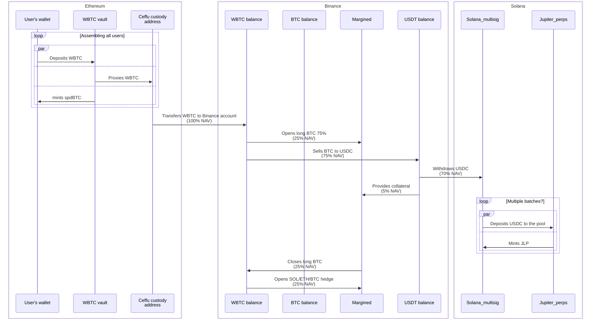

# Private deposits definition

In the doc below, we refer to private deposits as PD.

We expect a few users (~10) with a total amount of ~$10M worth of BTC to deposit their BTC into our strategy for some short period of time (3-4 months) to see how it scales.

# Caveats

We cannot just ask them to send us BTC in any form because of legal reasons. What we should do instead is to wrap the interaction in the form of a smart contract.

Thus, interaction should have a UI.

The UI, though, shouldn’t be very complex because we don’t have a lot of time/resources to build it, and since the number of users is low, we can try to solve some issues in an organisational way.

Thus, we expect the participants to make deposits in **WBTC on Ethereum**.

Since we cannot prepare the full automatic system for everything, the liquidity provision into the Jupiter perpetual pool is done manually.

# The general plan

The plan is the following:

1. We create the deposit UI
    1. The UI is open to PD participants only 
    2. The UI allows
        1. depositing WBTC (see [BBTC consideration ](https://www.notion.so/BBTC-consideration-1ca85d6b9b1080db8674e5f0bbfb3005?pvs=21) to know why only WBTC)
        2. Seeing your deposited balance (spdBTC essentially)
        3. Seeing the dashboard
2. We create an Ethereum smart contract that does the following:
    1. accepts WBTC deposits
    2. mints spdBTC (structured private deposits BTC) 1-1 to accepted BTC
    3. forwards WBTC deposits straight to the custody
3. Once **all the deposits are collected**, we start necessary operations to (manually) enter the Jupiter perps pool
4. Once everything is deposited, our main job is to maintain the dashboard and prepare for the next stages

Why do we want to mint a token (that is NOT maxBTC yet) on the PD stage? Few reasons:

1. We don’t know much yet about our clients’ way of storing funds. They probably want to use multisigs/Fireblocks-like solutions while our UI won’t probably work with them very well (there’s WalletConnect that works terribly, so let’s not rely on it). While it’s fine (?) for us to ask them to temporarily move funds to e.g. Ledger and deposit from there, it’s not great to ask them to store the receipt token on this Ledger (or anyhow have this address being responsible for further withdrawal). If they will be able to move spdBTC to their address of choice after the deposit, it might be very comfortable for them.
2. This gives us flexibility in a way to process PD withdrawals later (we can make a contract to exchange spdBTC to maxBTC or WBTC, with no touching the deposit contract, see  [Some thoughts on withdrawals](https://www.notion.so/Some-thoughts-on-withdrawals-1c985d6b9b1080cbb21bd9a9d2fde815?pvs=21) for details).

# Assets flow

Flow of funds during the private deposit stage:

# The estimation of entrance costs

In this section, we’re trying to estimate the total cost of entering the strategy.

Notes:

1. We asses the value **in BTC**
2. We don’t take into account any gas costs since they’re constant

Based on the assets flow provided above, we can see the following costs:

1. WBTC (25%) → BTC swap on Binance — fees around 0.1% and slippage of roughly 0.08% to 0.1%
2. WBTC (70%) → USDC swap on Binance — ?
3. USDC → JLP deposit (~0.3% fee?)
4. Costs of leverage longing BTC — ?
5. Costs of opening the hedges — ?
- Note on BTC→USDC→JLP slippage
    
    Potentially, we could get a slippage between selling BTC to USDC and providing liquidity into the JLP pool. This slippage comes from the following reasons:
    
    1. We have to enter Jupiter pool with USDC (actually not necessary USDC, but the thing we cannot enter with BTC, see [Direct mint/burn](https://www.notion.so/Direct-mint-burn-1b985d6b9b108068a8b3d0e38e9697c5?pvs=21) for details)
    2. Between selling BTC to USDC and entering Jupiter pool we have at least a few minutes gap (when BTC price moves) because of
        1. USDC withdrawal to Solana
        2. Manual multisig operations
    3. We value our funds BTC-denominated
    
    However, we hedge it by leveraging longing BTC with the 25% BTC that rests on our Binance account. Thus, if BTC prices rise, we get more BTC on Binance. If it falls, we get “more” JLP on Solana (compared to what we would get for the amount of BTC we had).
    

# Some thoughts on withdrawals

Two possible options for withdrawals:

1. Full withdrawal
    1. We can withdraw WBTC (if limits would allow us to do so) since the operation will be done manually anyway.
    2. We can bridge them with the Portal bridge to ETH to Ethereum and use these WBTC as the withdrawal asset
2. Migration to maxBTC
    1. We reuse the same setup for maxBTC/migrate all the funds to a newly created maxBTC setup
    2. We create a contract that allows private deposit users to get maxBTC in exchange for spdBTC
    3. They can withdraw their maxBTC with the regular procedure or keep them to proceed getting yield

# UI restriction mechanics

First, we should understand that UI restriction won’t save us completely from potentially unknown depositors. This is not something we really expect to happen, but it is something that still can occur. Because we work on Ethereum and don’t implement any restrictions on the smart contract level (that would overcomplicate things), and Ethereum is a dark forest in terms of on-chain stuff.

UI restrictions are made mostly to reduce the chance of information being revealed to potential competitors.

We have a few options for how we can implement it:

1. Full auth system — too expensive for implementation, requires DB and such
2. Cloudflare email gate — pretty good, requires no development, though requires (de)listing the specific emails/domains through devops
3. Basic auth — very easy to implement, requires (pre-generated) creds management, but not very beautiful
4. Some other built-in auth system — Vladimir is working on looking into it

# BBTC consideration

We can still consider the usage of BBTC for those clients that already have BTC on Binance. With BBTC being used in this case, we can save some on fees/slippage of WBTC to BTC on Binance. However, it’s complicated because of several reasons:

1. We need to do additional smart contract development. Not rocket science, but given the tight timeline, even a small lift makes an impact
2. It complicates the UI as well since it now should be able to work with two assets instead of one
3. It also creates some weird disbalance: those who provide BBTC reduce our costs, but the costs of swapping WBTC are distributed to everyone, including BBTC depositors. Still, we need to keep only 25% in BTC, so >25% BBTC deposits would be enough to avoid any swap losses here… however, it still adds layers of complexity which we cannot handle given the tight timeline

# Ethereum contract

The development of the contract is here:

[maxBTC Ethereum contract](https://www.notion.so/maxBTC-Ethereum-contract-1c985d6b9b10801bb711ebca605e1acc?pvs=21)

The contract to be deployed requires the following:

1. Custody address to forward funds to
2. Owner/admin multisig to manage the contract

# Timeline

[Untitled](https://www.notion.so/1ca85d6b9b1080499caee6b6d0d688df?pvs=21)

# Monitoring

Bad scenarios:

1. Funds are stolen
2. We’re liquidated

Thus, we need to monitor our balances and our positions' health (i.e., we have enough collateral and enough fees)