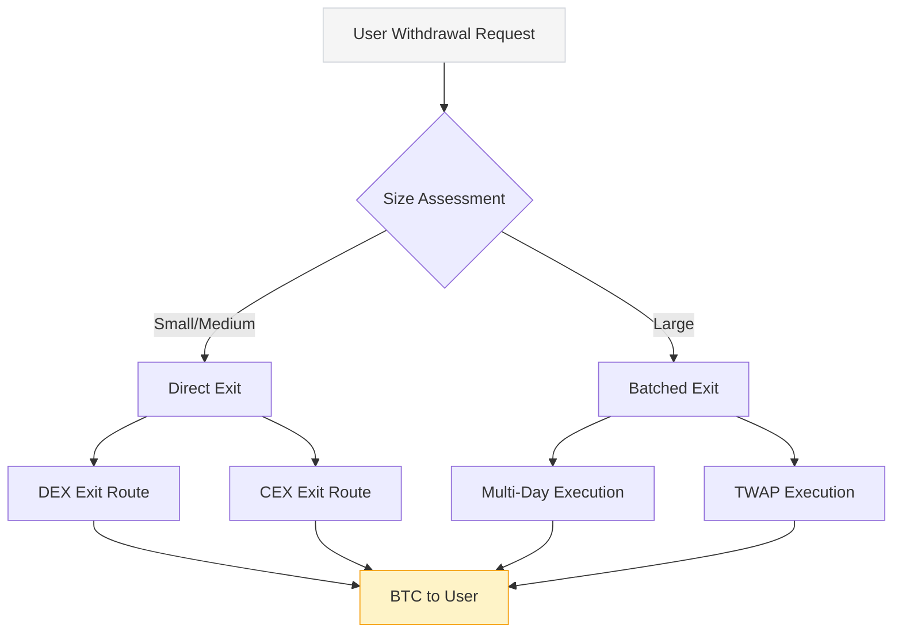

## Liquidity Architecture

<Card title="Intelligent Exit Routing" icon="route" className="w-full mb-6">
  
Most BTC yield strategies require unwinding complex positions for users to exit, creating significant friction. maxBTC solves this with:

  
  <ul className="list-disc pl-5 space-y-1 mb-3">
    <li>Multi-venue exit routing that optimizes costs based on current network conditions</li>
    <li>Smart order routing that distributes withdrawal transactions to minimize slippage</li>
    <li>Automated conversion between assets to find the optimal exit path</li>
    <li>Proprietary slippage mitigation algorithms for large withdrawals</li>
  </ul>
  
  

    For detailed technical implementation of asset flows, see our <a href="/technical/blockchain_integrations" className="text-blue-500 hover:underline">Blockchain Integrations</a> documentation.
  

</Card>

## Cross-Chain Compatibility

<CardGroup cols={2} className="mb-6">
  <Card title="Multi-Chain Presence" icon="globe">
    
maxBTC is designed to be available on multiple chains simultaneously:

    <ul className="list-disc pl-5 space-y-1">
      <li>Ethereum for wide DeFi integration and institutional access</li>
      <li>Neutron for efficient issuance and redemption processes</li>
      <li>Future expansion to additional EVM chains based on demand</li>
    </ul>
  </Card>

  <Card title="Cross-Chain Liquidity" icon="bolt">
    
Our approach optimizes for cross-chain efficiency:

    <ul className="list-disc pl-5 space-y-1">
      <li>IBC transfers between Cosmos-based chains for fast, low-cost transfers</li>
      <li>Unified liquidity management across different chain deployments</li>
      <li>Bridge-agnostic design that can adapt to the optimal cross-chain solutions</li>
    </ul>
  </Card>
</CardGroup>

## Secondary Market Advantages

<Card title="Market-Making & Price Discovery" icon="coins" className="w-full mb-6">
  

    Unlike traditional BTC yield solutions where users must wait for withdrawal processes, maxBTC's tokenized approach enables efficient secondary market activity:
  

  
  <ul className="list-disc pl-5 space-y-1">
    <li>AMM pools can facilitate instant trading of maxBTC positions</li>
    <li>Price discovery mechanism captures both NAV and market sentiment</li>
    <li>Arbitrage opportunities help maintain price stability relative to intrinsic value</li>
    <li>Secondary market transactions completely bypass withdrawal processes</li>
  </ul>
</Card>

## Technical Exit Mechanisms

  

    The technical exit flow builds on our cross-chain integration architecture. For complete details on asset movements between chains, please see the <a href="/technical/blockchain_integrations#cross-chain-asset-flow" className="text-blue-500 hover:underline">Cross-Chain Asset Flow</a> in our technical documentation.
  

<Card title="Liquidation Prevention Mechanisms" icon="shield-halved" className="w-full mt-6 mb-4">
  

    Our liquidity design includes advanced protection mechanisms that complement the <a href="/strategy/risks#key-risk-factors" className="text-blue-500 hover:underline">risk controls</a> detailed in our risk assessment:
  

  

    

      

      Dynamic collateralization ratio adjustments based on market volatility
    

    

      

      Real-time monitoring with automated risk mitigation
    

    

      

      Partial position unwinding protocols to protect against cascading liquidations
    

  

</Card>

<Note className="mt-4">
  For questions regarding withdrawal slippage, time frames, and other withdrawal-related topics, please refer to our <a href="/strategy/faq#technical-questions" className="text-blue-500 hover:underline">Strategy FAQ</a> section.
</Note> 