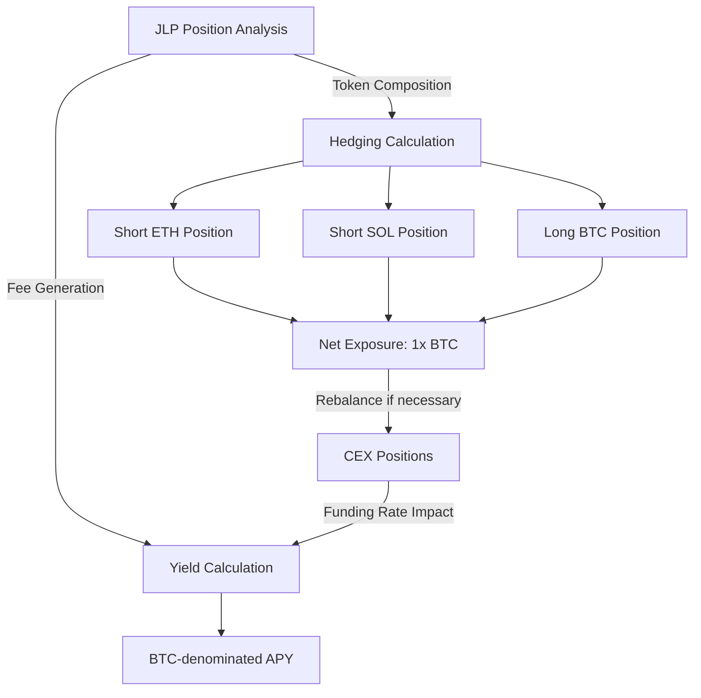
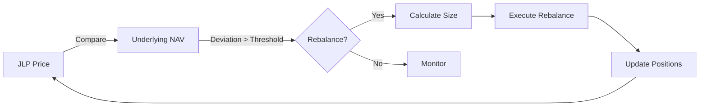

## Strategy Components

<CardGroup cols={2}>
  <Card>
    

      

        <i className="fas fa-coins"></i>
      

      <h3 className="text-lg font-semibold">JLP Position (70%)</h3>
    

    

      

        

        Deployed to <a href="https://jup.ag/perps-earn" className="text-blue-500 hover:underline">Jupiter JLP pool</a> on Solana
      

      

        

        Generates Perp DEX LP revenue
      

      

        

        Secured in multisig and continuously monitored
      

    

  </Card>
  
  <Card>
    

      

        <i className="fas fa-balance-scale"></i>
      

      <h3 className="text-lg font-semibold">CEX Hedging (30%)</h3>
    

    

      

        

        Deployed as collateral to Binance
      

      

        

        Short ETH and SOL positions create delta-neutral exposure
      

      

        

        Long BTC positions achieve effective 1x exposure
      

    

  </Card>
</CardGroup>

## Where does the Yield Come From?

  <Card>
    

      
<i className="fas fa-coins"></i>

      <h4 className="text-lg font-semibold">JLP APY Component (Primary Yield Driver)</h4>
    

    
This is the primary yield component, typically ranging from high single-digit percentages to as much as 40%, depending on market conditions and trading activity on Jupiter.

    
    
Revenue Sources:

    <ul className="list-inside mb-3">
      <li className="flex items-start">
        

        Trading fees from perpetual DEX activity
      </li>
      <li className="flex items-start">
        

        Borrowing fees from leveraged positions
      </li>
      <li className="flex items-start">
        

        Liquidation proceeds from underwater positions
      </li>
    </ul>
    
    

      Range:
      5-40%
    

  </Card>
  
  <Card>
    

      
<i className="fas fa-scale-balanced"></i>

      <h4 className="text-lg font-semibold">Rebalancing Arbitrage Component</h4>
    

    
Generated by rebalancing positions whenever the JLP trades at a discount or premium relative to its BTC valuation.

    
    

      Range:
      ~0.5%
    

  </Card>
  
  <Card>
    

      
<i className="fas fa-chart-line"></i>

      <h4 className="text-lg font-semibold">Funding Rate Impact</h4>
    

    
This is typically a cost rather than a yield component, though it can become positive during extreme market conditions.

    
    

      Range:
      -4% to +1%
    

  </Card>

<Note>
There can be discrepancies between the displayed APY on Jupiter's interface and the realized APY of JLP Delta Neutral because:

1. Not all principal is deployed at once (30% is reserved for hedging)
2. Funding fees can reduce returns
3. Jupiter displays APY in USD terms while we translate to BTC terms
</Note>

## Expected Performance

Based on our 90-day proof of concept with mainnet assets, the JLP Delta Neutral strategy achieved:
- **25% average APY** (during a period of high market volatility)
- **Rolling 30-day average APY** typically fluctuated between 10% and 40%

We expect long-term APY to stabilize in the 10-20% range over time, depending on market conditions.

## Technical Implementation

### BTC-Denominated Performance Metrics

<Card title="BTC-Denominated Performance Metrics" className="w-full mb-6">
  
JLP Delta Neutral reports all performance metrics in BTC terms rather than USD. This means:

  <ul className="list-disc pl-5 mt-2">
    <li>All positions and yields are evaluated in their BTC-denominated value</li>
    <li>APY reflects how much additional BTC you effectively accumulate</li>
    <li>Value per share (VPS) tracks each investor's proportional ownership</li>
  </ul>
</Card>

### Technical Rebalancing Process

<Card title="Optimal Rebalancing Logic" className="w-full mb-6">
  Our rebalancing system uses a proprietary algorithm to determine the optimal timing and size of rebalancing operations, considering:
  
  <ul className="list-disc pl-5 mt-3">
    <li>Gas costs vs expected arbitrage profit</li>
    <li>Market slippage on entry/exit</li>
    <li>JLP price deviations from NAV</li>
    <li>Market volatility conditions</li>
  </ul>
</Card>

## Advanced Strategy Management

<AccordionGroup>
  <Accordion title="JLP Composition Analysis">
    

      
We continuously monitor the JLP composition to ensure accurate hedging:

      
      

        

        Regular analysis of token distribution in the JLP
      

      

        

        Tracking exposure to SOL, ETH, and other assets
      

      

        

        Adjusting hedges based on changing pool composition
      

    

  </Accordion>
  
  <Accordion title="Exchange Execution">
    

      
We optimize for efficient execution when rebalancing:

      
      

        

        Minimizing slippage on entry and exit
      

      

        

        Order splitting to manage market impact
      

      

        

        Efficient gas usage for on-chain transactions
      

    

  </Accordion>
  
  <Accordion title="Funding Rate Management">
    

      
We actively monitor funding rates to manage costs:

      
      

        

        Monitoring funding rate environments across markets
      

      

        

        Balancing hedging needs with funding rate costs
      

      

        

        Accounting for funding impact on overall strategy returns
      

    

  </Accordion>
</AccordionGroup>

## Security and Monitoring

  <Card title="Automated Monitoring Systems" icon="robot">
    

      

        

        24/7 position tracking with custom alerting thresholds
      

      

        

        Real-time risk metrics calculation (VaR, stress tests)
      

      

        

        Custom API integrations with exchange platforms
      

    

  </Card>
  
  <Card title="Multi-signature Security" icon="key">
    

      

        

        Geographically distributed key holders
      

      

        

        Tiered access controls based on transaction size
      

      

        

        Hardware security module integration
      

    

  </Card>

### Current Market Limitations

<CardGroup cols={3}>
  <Card title="Points vs Real Yield" icon="ticket">
    

      Most BTC LRTs offer only points-based yield with uncertain long-term value rather than actual BTC yield.
    

  </Card>
  <Card title="Low Returns" icon="chart-line-down">
    

      Existing options typically generate only 4-7% APY, significantly lower than JLP Delta Neutral's target range.
    

  </Card>
  <Card title="Limited Composability" icon="puzzle-piece">
    

      Many high-yield BTC options lack DeFi composability, restricting their use as collateral or in other DeFi applications.
    

  </Card>
</CardGroup>

