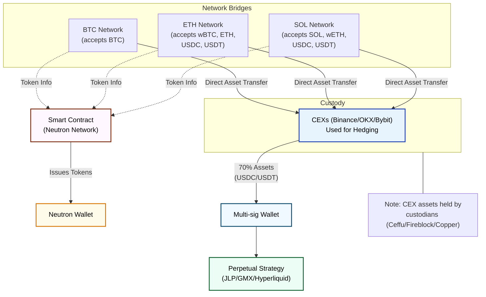

## Strategy Workflow

The JLP BTC Neutral strategy deploys capital in a 70/30 split:

1. **70% to Jupiter JLP pool**: Capital is deployed to a mix of SOL, ETH, BTC, USDC, and USDT in the pool
   - Generates yield through trading fees, liquidations, and price impact
   - Automatically compounds returns within the pool
2. **30% to hedging positions**: Used as collateral at centralized venues (Binance) to:
   - Short ETH, SOL to neutralize non-BTC exposure
   - Leverage long BTC to maintain effective 1:1 BTC price exposure

## Yield Sources

<CardGroup cols={3}>
  <Card title="JLP Pool Fees" icon="coins" iconType="duotone">
    Jupiter distributes 75% of trading fees to liquidity providers, including opening/closing fees, price impact, and liquidations
  </Card>
  
  <Card title="Rebalancing Arbitrage" icon="arrows-rotate" iconType="duotone">
    Capturing market inefficiencies and arbitrage opportunities between venues during periodic rebalancing
  </Card>
  
  <Card title="Funding Rates" icon="arrow-trend-up" iconType="duotone">
    Strategic management of funding rates from perpetual futures markets during volatile periods
  </Card>
</CardGroup>

## Strategy Architecture

## Historical Performance

Over a conclusive three-month live test run beginning on December 24, the strategy delivered an average 20% APY in real-world conditions, validating our expected performance range.

## APY Breakdown

  

    

    <strong>Expected APY Range</strong>: 10-20% depending on market conditions
  

  

    

    <strong>Strategy Capacity</strong>: $500M
  

  

    

    <strong>Pool Yield</strong>: 5-40% JLP pool yield converted to BTC with 0-4% funding rate cost
  

  

    

    <strong>Market Conditions</strong>: Performance typically improves during market crashes due to increased DEX fees
  

Future maxBTC strategies (e.g., CHF carry trade) will scale up to $100B+ at 3-7% APY.

## Strategy Advantages

<CardGroup cols={2}>
  <Card title="Market-Neutral Design" icon="scale-balanced" iconType="duotone">
    The strategy is deliberately designed to be neutral to all market movements except BTC, maintaining an effective 1x long BTC position regardless of market conditions.
  </Card>
  
  <Card title="Automated Rebalancing" icon="arrows-rotate" iconType="duotone">
    Positions are automatically rebalanced to accurately reflect changes in the JLP pool composition and the net open position of all traders.
  </Card>

  <Card title="Capture of Market Volatility" icon="chart-line-up" iconType="duotone">
    The strategy actually benefits from market volatility through increased trading fees in the Jupiter pool and higher opportunities for rebalancing arbitrage.
  </Card>
  
  <Card title="Sustainable Yield Source" icon="seedling" iconType="duotone">
    Unlike points-based rewards or temporary incentives, this yield comes from real trading activity and market inefficiencies that are inherent to crypto markets.
  </Card>
</CardGroup>

<Note>
  For a comprehensive analysis of all risk factors and control mechanisms, see our detailed <a href="/strategy/risks" className="text-amber-600 hover:text-amber-500 font-medium">Risk Management Framework</a>.
</Note>
