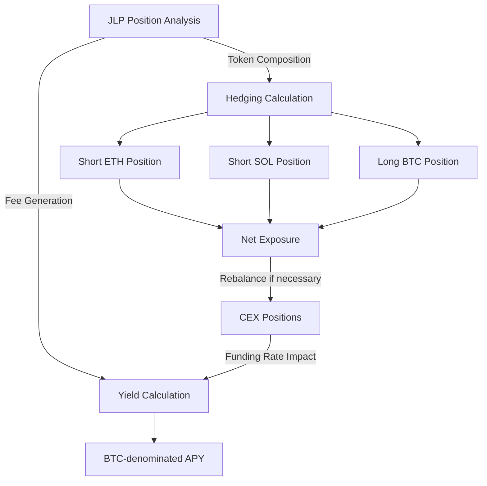

# Technical Strategy Details

This page outlines the technical implementation details of the maxBTC strategy, explaining how we generate BTC-denominated yield while maintaining appropriate risk controls.

## Position Management

{/* [IMAGE NEEDED: Add a diagram showing position management workflow] */}

### JLP Position Management

The Jupiter Liquidity Provider (JLP) position represents approximately 70% of the deployed capital. This position:

- Is held on Solana blockchain in a secure multisig wallet
- Generates fees from the Jupiter perpetuals DEX
- Fluctuates based on the performance of the underlying assets (BTC, ETH, SOL, USDC/USDT)

The system constantly monitors the token composition of JLP to maintain accurate hedging positions.

### CEX Hedging

The remaining 30% of capital is deployed on centralized exchanges (primarily Binance) to:

1. Create delta-neutral exposure to non-BTC assets in the JLP
2. Maintain an effective 1x long BTC position
3. Manage funding rate exposure

## APY Calculation Methodology

maxBTC reports APY figures calculated in BTC terms, rather than USD terms. This means:

- All positions and yields are evaluated in their BTC-denominated value
- The reporting focuses on how much BTC you effectively accumulate
- The value per share (VPS) metric tracks each investor's proportional ownership

### APY Components

<CardGroup cols={1} className="w-full">
  <Card title="JLP APY">
    This is the primary yield component, typically ranging from high single-digit percentages to as much as 40%, depending on market conditions and trading activity on Jupiter.
  </Card>
  
  <Card title="Hedging APY">
    Generated by rebalancing positions whenever the JLP trades at a discount or premium relative to its BTC valuation. Typically yields approximately 0.5% annually.
  </Card>
  
  <Card title="Funding Rate Cost">
    This is typically a cost rather than a yield component. Historically ranges between -1% and -4%, though it can become positive during extreme market conditions.
  </Card>
</CardGroup>

<Note>
There can be discrepancies between the displayed APY on Jupiter's interface and the realized APY of maxBTC because:

1. Not all principal is deployed at once (30% is reserved for hedging)
2. Funding fees can reduce returns
3. Jupiter displays APY in USD terms while we translate to BTC terms
</Note>

## Risk Management

The strategy employs multiple risk management techniques:

### Liquidation Protection

With a 70/30 deployment ratio, the strategy is designed to withstand a BTC price drop of approximately 45% before facing liquidation risk. This safety buffer has proven sufficient based on historical data - BTC has never experienced a weekly drop exceeding 33.52% since perpetual listing on Binance in 2019.

Alternative deployment ratios offer different risk/reward profiles:
- **40-60 Deployment**: Requires a 66.6% price drop for liquidation, with a yield reduction of 14%
- **50-50 Deployment**: Virtually eliminates liquidation risk but reduces yield by 28%

### Hedging Approach

The hedging strategy focuses on:
1. Underlying tokens in JLP (rather than weights on JLP index)
2. Net trader positions against the JLP pool

This ensures a more accurate hedge that adjusts to real-time market conditions rather than relying on static allocations.

### Position Monitoring

The system continuously monitors:
- JLP token composition
- Net positions of traders
- Price movements of all relevant assets
- Collateral levels and liquidation thresholds

Automated alerts trigger if any metric approaches predefined risk thresholds.