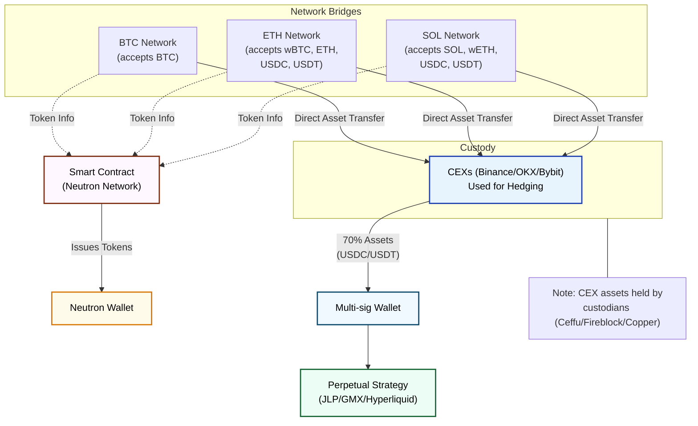

This page explains the technical implementation details of how the JLP BTC Neutral strategy operates.

## Jupiter Integration Details

### JLP Pool Mechanics

<CardGroup cols={2}>
  <Card title="JLP Deployment (70%)" icon="coins" iconType="duotone">
    <ul className="mt-2 space-y-1">
      <li className="flex items-start">
        

        Capital deployed to Jupiter's perpetual DEX liquidity pool
      </li>
      <li className="flex items-start">
        

        Generates yield through trading fees, liquidations, and price impact
      </li>
      <li className="flex items-start">
        

        Automatically compounds returns within the pool
      </li>
    </ul>
  </Card>

  <Card title="CEX Hedging (30%)" icon="scale-balanced" iconType="duotone">
    <ul className="mt-2 space-y-1">
      <li className="flex items-start">
        

        Used as collateral at centralized venues (Binance)
      </li>
      <li className="flex items-start">
        

        Creates short positions on SOL/ETH to neutralize exposure
      </li>
      <li className="flex items-start">
        

        Leverages long BTC to maintain effective 1:1 BTC exposure
      </li>
    </ul>
  </Card>
</CardGroup>

## Accelerated Exit Mechanism

To provide instant liquidity for users, we've implemented an accelerated exit system:

### Implementation Details

- **Buffer Maintenance**: ~10% of wBTC deposits maintained on Neutron network
- **Order Placement**: Limit orders posted on Duality DEX at 1-2% premium above redemption price
- **Automatic Rebalancing**: Buffer automatically adjusts based on deposit/withdrawal flows
- **Cross-Chain Access**: Available via routing protocols like Skip Go and LiFi

### Benefits

<CardGroup cols={3}>
  <Card title="Atomic Execution" icon="bolt" iconType="duotone">
    Users receive wBTC in the same transaction when market-selling maxBTC
  </Card>
  
  <Card title="Instant Settlement" icon="clock" iconType="duotone">
    No waiting for standard redemption cycles or cross-chain transfers
  </Card>
  
  <Card title="Aggregated Liquidity" icon="droplet" iconType="duotone">
    Better pricing through combined liquidity from multiple sources
  </Card>
</CardGroup>

## Risk Management

The JLP BTC Neutral strategy employs several key risk management techniques to protect capital and maintain stable returns:

<CardGroup cols={2}>
  <Card title="Delta Neutrality" icon="scale-balanced" iconType="duotone">
    Maintains neutrality to all market movements except BTC through active hedging
  </Card>
  
  <Card title="Liquidation Protection" icon="shield" iconType="duotone">
    Positions are structured so BTC would need to drop ~45% in a short period to trigger liquidation
  </Card>
  
  <Card title="Rebalancing Thresholds" icon="arrows-rotate" iconType="duotone">
    Automated rebalancing triggers when positions deviate beyond set parameters
  </Card>
  
  <Card title="Position Monitoring" icon="eye" iconType="duotone">
    24/7 monitoring of all positions with redundant systems
  </Card>
</CardGroup>

<Card title="Comprehensive Risk Analysis" icon="shield-exclamation" href="/strategy/risks">
  For detailed information about all risk factors, controls, and monitoring infrastructure, see our complete risk assessment.
</Card>