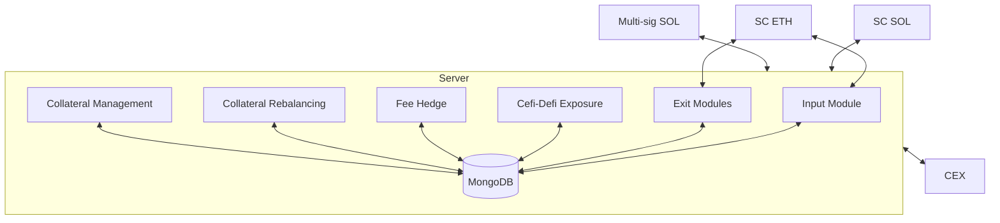

This page provides technical details about maxBTC's implementation across different blockchains, security considerations, and system architecture.

  <Card title="Blockchain Integrations" icon="link-simple" href="/technical/blockchain_integrations">
    Implementation details for Ethereum, Solana, and cross-chain flows including asset management across blockchains
  </Card>
  <Card title="Security Model" icon="shield-halved" href="/technical/security">
    Security considerations, multisig implementations, and comprehensive risk management controls
  </Card>

## System Overview

The maxBTC server is built in Rust and follows a modular design pattern. Communication between modules happens through shared database state and the global JLP token tracking system.

### Key Technologies

The application is built with:

- **Axum** for HTTP endpoints and API
- **Tokio** for asynchronous background processes
- **MongoDB** for persistent state management
- **Direct RPC/WebSocket** connections to blockchain networks and exchanges

## System Architecture Diagram

## Key Architectural Components

### Microservices

Each component of the maxBTC system is implemented as a dedicated microservice:

- **Input Module**: Processes user deposits and manages asset allocation
- **Exit Module**: Handles withdrawals and redemptions
- **CeFi-DeFi Exposure Manager**: Balances positions across centralized and decentralized venues
- **Fee Hedge**: Converts collected trading fees to BTC
- **Collateral Rebalancing**: Maintains delta neutrality as market conditions change
- **Collateral Management**: Optimizes capital allocation across venues

## Microservice Integration Matrix

  <table className="w-full mt-4">
    <thead>
      <tr>
        <th>Microservice</th>
        <th>CEX</th>
        <th>SC (ETH)</th>
        <th>SC (SOL)</th>
        <th>MongoDB</th>
        <th>Multi-sig</th>
      </tr>
    </thead>
    <tbody>
      <tr>
        <td><strong>Input Module</strong></td>
        <td>✓</td>
        <td>✓</td>
        <td>-</td>
        <td>✓</td>
        <td>✓</td>
      </tr>
      <tr>
        <td><strong>Cefi-Defi Exposure</strong></td>
        <td>✓</td>
        <td>-</td>
        <td>✓</td>
        <td>✓</td>
        <td>✓</td>
      </tr>
      <tr>
        <td><strong>Fee Hedge</strong></td>
        <td>✓</td>
        <td>-</td>
        <td>✓</td>
        <td>✓</td>
        <td>✓</td>
      </tr>
      <tr>
        <td><strong>Collateral Management</strong></td>
        <td>✓</td>
        <td>-</td>
        <td>-</td>
        <td>✓</td>
        <td>-</td>
      </tr>
      <tr>
        <td><strong>Collateral Rebalancing</strong></td>
        <td>✓</td>
        <td>-</td>
        <td>✓</td>
        <td>✓</td>
        <td>✓</td>
      </tr>
      <tr>
        <td><strong>Exit Module</strong></td>
        <td>✓</td>
        <td>✓</td>
        <td>-</td>
        <td>✓</td>
        <td>✓</td>
      </tr>
    </tbody>
  </table>

  This matrix shows which external systems each microservice integrates with.

## State Management

The system uses two primary methods for state management:

1. **Persistent Store**: MongoDB maintains the system state for recovery and analytics
2. **In-Memory Cache**: A shared global state for Jupiter LP token tracking provides high-performance token balance access

The in-memory cache is periodically verified against on-chain data to ensure consistency and detect discrepancies.

<Note>
  For security considerations including API key management, multisig implementation, and system recovery details, see the [Security Model](/technical/security) documentation.
</Note>