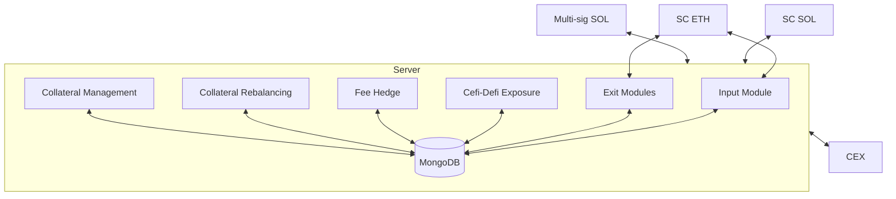

# maxBTC Technical Architecture

This document details the comprehensive JLP (Jupiter Liquidity Provider) token strategy execution system. The architecture is based on microservices that coordinate to manage portfolio exposure, execute trades, and maintain collateral requirements.

## System Overview

The server architecture consists of 6 microservices plus one non-process component that coordinate to execute the strategy. The system relies on two primary sources of truth:

1. **On-chain and Exchange Data**: Real-time information from Solana smart contracts, Ethereum Smart contract, and Binance exchange accounts
2. **Persistent Database**: MongoDB collections that track system state, exposures, and execution history

{/* Alternative Mermaid diagram if needed: */}

## Microservices

<CardGroup cols={2}>
  <Card title="Input Module" icon="arrow-right-to-bracket">
    - Provides an estimate of Buy price for the system
    - Listens to any deposit signal and updates Smart Contract
    - Processes initial configuration
    - Converts 70% of assets to USDC for JLP buying
    - Handles JLP position entry in tranches
  </Card>

  <Card title="Exposure Management" icon="scale-balanced">
    - Runs delta exposure calculations every minute
    - Executes trades to close delta mismatches
    - Updates main documentation and logs execution details
  </Card>

  <Card title="Fee Hedge" icon="money-bill-transfer">
    - Handles revenue rebalancing
    - Sells JLP earnings to maintain target exposure
    - Manages JLP/BTC price impact
  </Card>

  <Card title="Reporting" icon="chart-line">
    - Calculates NAV based on all positions
    - Determines hourly and daily NAV changes
    - Calculates rolling APY at different intervals
    - Generates comprehensive reporting documentation
  </Card>

  <Card title="Exit Module" icon="door-open">
    - Provides estimate of exit slippage
    - Monitors smart contract for withdrawal instructions
    - Sells JLP positions and unwinds hedges
    - Transfers assets to exchanges and sends required assets to smart contract
  </Card>

  <Card title="Collateral Management" icon="vault">
    - Ensures USDT balance remains above 1% of open positions
    - Executes BTC sales for USDT when necessary
    - Maintains delta neutrality by adjusting hedge positions
    - Creates and updates reporting documentation
  </Card>
</CardGroup>

## Integration Matrix

  <table className="w-full mt-4">
    <thead>
      <tr>
        <th>Microservice</th>
        <th>CEX</th>
        <th>SC (ETH)</th>
        <th>SC (SOL)</th>
        <th>MongoDB</th>
        <th>Multi-sig</th>
      </tr>
    </thead>
    <tbody>
      <tr>
        <td><strong>Input Module</strong></td>
        <td>✅</td>
        <td>✅</td>
        <td>-</td>
        <td>✅</td>
        <td>✅</td>
      </tr>
      <tr>
        <td><strong>Cefi-Defi Exposure</strong></td>
        <td>✅</td>
        <td>-</td>
        <td>✅</td>
        <td>✅</td>
        <td>✅</td>
      </tr>
      <tr>
        <td><strong>Fee Hedge</strong></td>
        <td>✅</td>
        <td>-</td>
        <td>✅</td>
        <td>✅</td>
        <td>✅</td>
      </tr>
      <tr>
        <td><strong>Collateral Management</strong></td>
        <td>✅</td>
        <td>-</td>
        <td>-</td>
        <td>✅</td>
        <td>-</td>
      </tr>
      <tr>
        <td><strong>Collateral Rebalancing</strong></td>
        <td>✅</td>
        <td>-</td>
        <td>✅</td>
        <td>✅</td>
        <td>✅</td>
      </tr>
      <tr>
        <td><strong>Exit Module</strong></td>
        <td>✅</td>
        <td>✅</td>
        <td>-</td>
        <td>✅</td>
        <td>✅</td>
      </tr>
    </tbody>
  </table>

## Security Considerations

<AccordionGroup>
  <Accordion title="API Key Management">
    Binance API Keys: IPs are whitelisted and only allowed to trade. Read only keys can work without IP whitelisting for monitoring - Ceffu
  </Accordion>
  <Accordion title="Microservice Architecture">
    Microservices are made mutually exhaustive to each other - sync if required, but can be done with a lag, we do it on timestamp based. Example, input module should be in sync with Cefi-Defi Exposure Management
  </Accordion>
  <Accordion title="System Recovery">
    System reset - should resume based on data from CEX's position and JLP position in the multi-sig
  </Accordion>
  <Accordion title="Binance Security">
    Whitelist address - Multi-sig or the ETH SC, Ceffu setup
  </Accordion>
</AccordionGroup>

## Scope for Multi-sig

The multi-sig is responsible for critical operations:

- Buying capability of JLP
- Sell Capability of JLP
- Transfer to CEX
- Whitelist CEX addresses

## Implementation Details

The codebase is organized into logical modules:

- **src/rpc/**: Contains Solana and other blockchain RPC client implementations
- **src/external_ws/**: WebSocket clients for exchange data and order execution
- **src/models/**: MongoDB data models for persisting strategy state
- **src/fetch_systems/**: Data retrieval from various external systems
- **src/exposure_management/**: Core strategy execution logic
- **src/execution/**: Trade execution and order management

The server uses a shared global state for JLP token tracking (JLP_TOKENS) which acts as an in-memory cache that is periodically verified against on-chain data. 