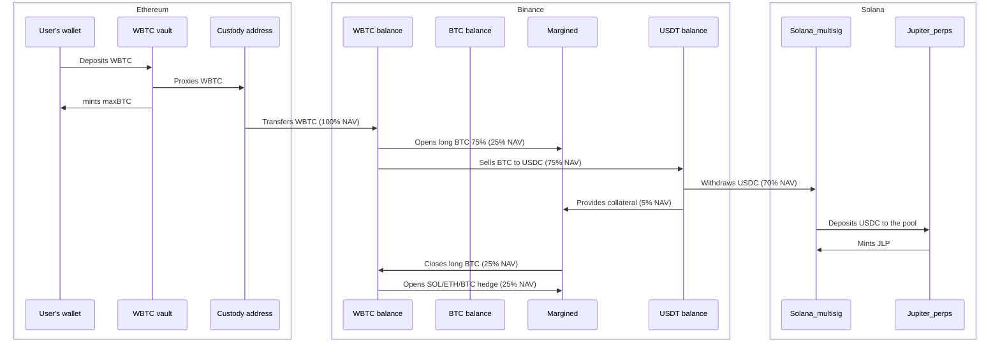

maxBTC operates across multiple blockchain networks to optimize yield generation while maintaining security and cross-chain liquidity.

## Supported Networks

<CardGroup cols={3}>
  <Card title="Ethereum">
    User deposits (wBTC, ETH, USDC, USDT) and vault contract deployment
  </Card>
  
  <Card title="Solana">
    Yield generation through Jupiter JLP pool and perpetual trading
  </Card>
  
  <Card title="Neutron">
    maxBTC token minting, cross-chain coordination, and accelerated exit liquidity buffer
  </Card>
</CardGroup>

## Network-Specific Implementations

### Ethereum Integration

**Primary Functions:**
- User deposit acceptance (wBTC, ETH, USDC, USDT)
- Vault contract for asset custody
- Asset forwarding to custody addresses

**Smart Contracts:**
- Vault contracts for secure asset custody
- Proxy contracts for asset forwarding
- Cross-chain messaging coordination

### Solana Integration

**Jupiter Perpetuals Integration:**

Solana serves as the primary yield generation engine through deep integration with Jupiter's perpetual trading infrastructure:

- **JLP Pool Access**: Direct integration with Jupiter's $1.75B+ liquidity pool for sustainable yield generation
- **Multi-Asset Exposure**: Automatic exposure management across SOL, ETH, BTC, USDC, and USDT within the pool
- **Real-Time Yield Capture**: 75% of all trading fees, liquidations, and price impact distributed to liquidity providers
- **Automated Rebalancing**: Dynamic position adjustments based on pool composition and trader positioning
- **Cross-Chain Bridging**: Seamless USDC transfers from Binance for optimal capital deployment

### Neutron Integration

**Cross-Chain Coordination:**
- **maxBTC Token Minting**: Primary network where maxBTC tokens are minted and managed
- **Accelerated Exit Buffer**: ~10% of wBTC deposits maintained for instant liquidity
- **Duality Integration**: Single-sided wBTC limit orders at 1-2% premium for atomic exits
- **Cross-Chain Routing**: Available via Skip Go, LiFi, and other routing protocols
- **Fast Finality**: 30-second settlement to Ethereum and other networks vs 30-minute reverse flow

## Cross-Chain Asset Flow

## Cross-Chain Security Model

### Multi-Signature Implementation

- **Geographic Distribution**: Key holders distributed across different jurisdictions
- **Threshold Requirements**: Multi-sig authorization for all critical operations
- **Backup Systems**: Multiple execution pathways for redundancy

### Asset Custody

<CardGroup cols={2}>
  <Card title="Off-Exchange Custody" icon="vault" iconType="duotone">
    30% held in custody with Ceffu/Fireblocks/Copper for collateral management
  </Card>
  
  <Card title="On-Chain Transparency" icon="eye" iconType="duotone">
    70% held as JLP tokens with full on-chain verification and balance visibility
  </Card>
</CardGroup>

## Integration Roadmap

Future blockchain integrations planned:

- **Bitcoin Network**: Native BTC deposit support
- **Arbitrum**: Additional Ethereum L2 support  
- **Base**: Coinbase ecosystem integration
- **Polygon**: Enhanced cross-chain liquidity

<CardGroup cols={2}>
  <Card title="System Architecture" icon="server" href="/technical/architecture">
    Explore the complete technical architecture powering maxBTC
  </Card>
  
  <Card title="Strategy Implementation" icon="gears" href="/strategy/technical_details">
    Learn how the JLP BTC Neutral strategy operates under the hood
  </Card>
</CardGroup> 