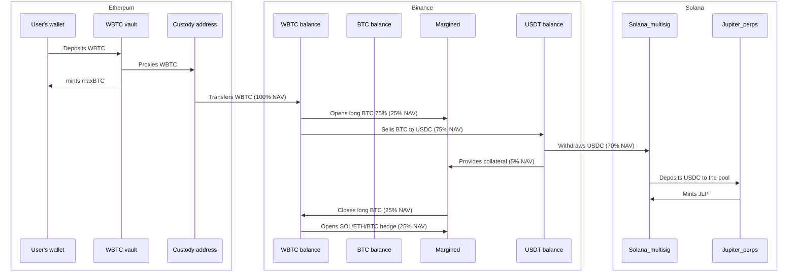

maxBTC operates across multiple blockchain networks to optimize yield generation while maintaining security and cross-chain liquidity.

## Supported Networks

<CardGroup cols={3}>
  <Card title="Ethereum">
    User deposits (wBTC, ETH, USDC, USDT) and vault contract deployment
  </Card>
  
  <Card title="Solana">
    Yield generation through Jupiter JLP pool and perpetual trading
  </Card>
  
  <Card title="Neutron">
    maxBTC token minting, cross-chain coordination, and accelerated exit liquidity buffer
  </Card>
</CardGroup>

## Network-Specific Implementations

### Ethereum Integration

  

    

    User deposit acceptance (wBTC, ETH, USDC, USDT)
  

  

    

    Vault contract for asset custody
  

  

    

    Asset forwarding to custody addresses
  

### Solana Integration

**Primary Yield Generation:**

Solana serves as the primary yield generation engine through Jupiter's perpetual trading infrastructure, providing access to sustainable DeFi yield opportunities.

  

    

    <strong>Jupiter Integration</strong>: Deep integration with Jupiter's perpetual market ecosystem for yield generation
  

  

    

    <strong>Multi-sig Management</strong>: Secure asset management through distributed key controls
  

  

    

    <strong>Cross-Chain Bridging</strong>: Seamless USDC transfers for optimal capital deployment
  

<Note>
  For detailed information about Jupiter JLP integration and strategy implementation, see our <a href="/strategy/overview" className="text-amber-600 hover:text-amber-500 font-medium">JLP BTC Neutral Strategy</a> documentation.
</Note>

### Neutron Integration

**Cross-Chain Coordination:**

  

    

    <strong>maxBTC Token Minting</strong>: Primary network where maxBTC tokens are minted and managed
  

  

    

    <strong>Accelerated Exit Buffer</strong>: ~10% of wBTC deposits maintained for instant liquidity
  

  

    

    <strong>Duality Integration</strong>: Single-sided wBTC limit orders at 1-2% premium for atomic exits
  

  

    

    <strong>Cross-Chain Routing</strong>: Available via Skip Go, LiFi, and other routing protocols
  

  

    

    <strong>Fast Finality</strong>: 30-second settlement to Ethereum and other networks vs 30-minute reverse flow
  

## Cross-Chain Asset Flow

## Cross-Chain Security Model

### Multi-Signature Implementation

  

    

    <strong>Geographic Distribution</strong>: Key holders distributed across different jurisdictions
  

  

    

    <strong>Threshold Requirements</strong>: Multi-sig authorization for all critical operations
  

  

    

    <strong>Backup Systems</strong>: Multiple execution pathways for redundancy
  

### Asset Custody

<CardGroup cols={2}>
  <Card title="Off-Exchange Custody" icon="vault" iconType="duotone">
    30% held in custody with Ceffu/Fireblocks/Copper for collateral management
  </Card>
  
  <Card title="On-Chain Transparency" icon="eye" iconType="duotone">
    70% held as JLP tokens with full on-chain verification and balance visibility
  </Card>
</CardGroup>

## Integration Roadmap

Future blockchain integrations planned:

  

    

    <strong>Bitcoin Network</strong>: Native BTC deposit support
  

  

    

    <strong>Arbitrum</strong>: Additional Ethereum L2 support
  

  

    

    <strong>Base</strong>: Coinbase ecosystem integration
  

  

    

    <strong>Polygon</strong>: Enhanced cross-chain liquidity
  

