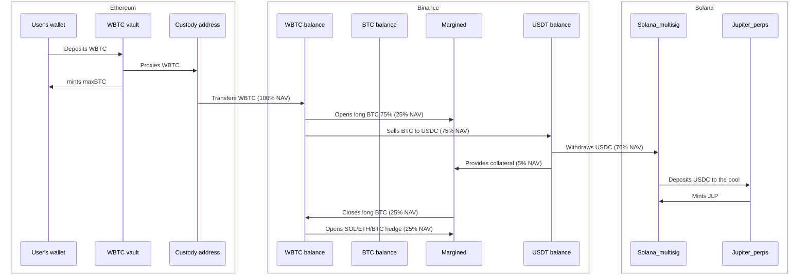

maxBTC operates across multiple blockchains to optimize yield generation while maintaining security. This document details our implementation across different chains.

## Solana Integration

Solana integration serves a primary purpose: extracting yield from Jupiter Liquidity Provider (JLP) tokens.

<Note>
JLP is an LP token of the Jupiter Perpetuals pool. Essentially, it's an index token of 5 assets (SOL, ETH, BTC, USDC, USDT). Besides that, it also compounds Jupiter trading fees and traders' PnL.
</Note>

### Jupiter Perpetuals Overview

High-level operations of the "JLP" part are:

1. Getting deposits from Ethereum/Binance to Solana
2. Processing withdrawals back to Ethereum
3. Rebalancing positions when needed

### Jupiter Integration Challenges

When interacting with Jupiter's JLP, there are several limitations to consider:

1. **Total TVL Cap**: We cannot provide more assets than the platform limit (current remaining quota is approximately 320M)
2. **Per-asset Limit**: We cannot provide more than the target weightage +20% for each asset
3. **Asset Restrictions**: From Binance on Solana, we can only withdraw SOL, USDC, and USDT

<Warning>
The current target weightage for BTC is 11%, thus it can fluctuate only between 8.8% and 13.2%. However, if the current weight exceeds this range (e.g., 14.63%), no BTC can be provided despite what the UI might show.
</Warning>

## Ethereum Integration

The Ethereum blockchain is used for:

1. Accepting user deposits (WBTC)
2. Minting maxBTC tokens
3. Processing redemptions

Our smart contracts on Ethereum include vault contracts for custodying assets and token contracts for the maxBTC synthetic asset.

## Cross-Chain Asset Flow

The following diagram shows how assets flow through the system:

